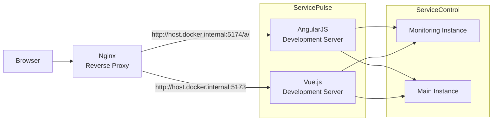

# ServicePulse 

ServicePulse provides real-time production monitoring for distributed applications. It keeps track of the health of a system's endpoints, monitors for processing errors, sends failed messages for reprocessing, and ensures the specific environment's needs are met, all in one consolidated dashboard.

ServicePulse is part of the [Particular Service Platform](https://particular.net/service-platform), which includes [NServiceBus](https://particular.net/nservicebus) and tools to build, monitor, and debug distributed systems.

See the [ServicePulse documentation](https://docs.particular.net/servicepulse/) for more information.

## Setting up the project for development

ServicePulse is in the process of migrating from AngularJS to Vue.js, during which both frameworks are used to serve parts of the application. In the development environment, AngularJS and Vue.js HTTP servers are run side-by-side behind a reverse proxy. This enables accessing both applications from the same domain, i.e., `localhost:1331` where uri prefixed with `/a/` are served by AngularJS, and Vue.js handles the rest. This mimics the production deployment where the Vue.js application is deployed in the main folder and AngularJS in the `/a/` subfolder. 



### Setting up ServiceControl Main and ServiceControl Monitoring instances

ServicePulse mainly presents data provided by [ServiceControl](https://docs.particular.net/servicecontrol) and [ServiceControl Monitoring](https://docs.particular.net/servicecontrol/monitoring-instances/) instances.

The URLs for both services can be set in `ServicePulse.Host/vue/public/app/js/app.constants.js` under the `scConfig` constant.

### Setting up package managers

ServicePulse uses [npm](https://www.npmjs.com/) and [Bower](https://bower.io/) as package managers. For the solution to work, dependencies must be downloaded before launching the ServicePulse website.

#### Install dependencies

Install the following dependencies if you don't have them installed yet

 - [Node.js](https://nodejs.org/en/download/)
 - [Git for Windows](https://gitforwindows.org/)
 - [Docker](https://docs.docker.com/get-docker/)
   - Note that if running docker for Windows, the current user needs to be in the docker-users local group. If your Windows account differs from the installation (admin) account, you must manually add your user to the group. See https://docs.docker.com/desktop/faqs/windowsfaqs/#why-do-i-see-the-docker-desktop-access-denied-error-message-when-i-try-to-start-docker-desktop
 - Chutzpah
   - [Test Adapter for the Test Explorer](https://marketplace.visualstudio.com/items?itemName=vs-publisher-2795.ChutzpahTestAdapterfortheTestExplorer)
   - [Test Runner Context Menu Extension](https://marketplace.visualstudio.com/items?itemName=vs-publisher-2795.ChutzpahTestRunnerContextMenuExtension)

### Set development environment

#### Step 0 - Using a suitable IDE for frontend development

Even though Visual Studio or Rider seem to be adequate IDEs for front-end development, they don't tend to do a good job with the latest front-end frameworks, linting, and formatting.
Because of that, we have [extra recommendations](/docs/frontend/frontend-ide.md) for you to be even more successful at front-end development.

#### Step 1 - run the Nginx reverse proxy
  
Open a command window and navigate to `ServicePulse\src\ServicePulse.Host` path (NOTE: On Windows, ensure [cmd](https://learn.microsoft.com/en-us/windows-server/administration/windows-commands/cmd) is being used and not [PowerShell](https://learn.microsoft.com/en-us/powershell/)). Run `nginx` that will act as the reverse proxy for AngularJS and Vue.js applications:

```cmd
docker run -it --rm -p 1331:1331 -v ./nginx.conf:/etc/nginx/nginx.conf:ro --name service-pulse-dev nginx
```

#### Step 2 - run the AngularJS development server 

Navigate to `ServicePulse\src\ServicePulse.Host\angular` and:
  - run `npm install` to install all the npm dependencies
  - run the following command `npm run dev`. This will host a dev server on port 5174 and start watching for changes in `/angular` directory

_Note: If you receive an error similar to `Error: error:0308010C:digital envelope routines::unsupported` when Webpack attempts to execute `LoadRunner.js`, it means that you need to configure Node to use a legacy SSL provider. You can do this by setting an environment variable called `NODE_OPTIONS` to the value `--openssl-legacy-provider`. E.g. Run `export NODE_OPTIONS=--openssl-legacy-provider` from a bash shell.
 
#### Step 3 - run the Vue.js development server 

Navigate to `ServicePulse\src\ServicePulse.Host\vue` and:
  - run `npm install` to install all the npm dependencies
  - run the following command `npm run dev` (this will host a dev server on port 5173 and start watching for changes in `/vue` directory)

If `npm run dev` fails with an error related to git submodules not being correctly configured, run the `npm install` command again to ensure all required dependencies are available, and then run `npm run dev`.

#### Step 4 - open the browser

After doing the above steps, navigate to `http://localhost:1331` to see the ServicePulse application.

### Provided npm scripts 

#### Vue.js

 - `dev` - runs `vite` that starts the development server doing hot reload over source files
 - `build` - runs build script that outputs files to `..\app` folder
 - `lint` - checks with eslint all Vue, ts and js files
 - `type-check` - runs TypeScript in no emit mode

#### AngularJS

 - `test` - runs js tests in ServicePulse.Host.Test project
 - `setup` - this command runs a few commands
 	- installs the npm packages
 	- runs `webpack`  
 - `load` - this command does the same thing as `setup`, but webpack is run only once to produce artifacts. The builder uses this command
 - `serve` - serves js artifacts using `http-server`
 - `webpack` - runs webpack command, which does the following things for the given modules (monitoring, configuration)
	 - joins js together 
	 - runs babel transpiler 
	 - has a file watcher to run the above whenever a file is saved
 - `lint` - checks with eslint all js files
 - `dev` - runs in parallel two scripts, `webpack` and `serve`

NOTE:
Webpack observes files and updates the artifacts whenever they are changed, however at the moment not every bit of code is processed by webpack. Only monitoring and configuration-related files are.

### Configuring automated tests

For information on how to run automated tests, please follow [ServicePulse.Host.Tests/Readme](https://github.com/Particular/ServicePulse/blob/master/src/ServicePulse.Host.Tests/README.md).

## Running from ServicePulse.Host.exe

It is possible to run ServicePulse directly via `ServicePulse.Host.exe`.

### Step 1 - reserve URL ACL

ServicePulse.Host.exe depends on a self-hosted web server. A URL ACL reservation needs to be set up to start the project. Either run Visual Studio with Administrative privileges or run the following command to add the required URL ACL reservation:

```
add urlacl url=URL
```

Where `URL` is the configured URL on the local machine.

### Step 2 - build ServicePulse site 

Execute the build script from the command line:

```cmd
PowerShell -File .\build.ps1
```

NOTE: It might be necessary to change the PowerShell execution policy using `Set-ExecutionPolicy Unrestricted -scope UserPolicy`

### Step 3 - run `ServicePulse.Host.exe`

Build and run the `ServicePulse.Host` project in the IDE.

## Supported browser versions

ServicePulse is supported on the following desktop browser versions:

- Chrome [latest major version](https://chromereleases.googleblog.com/)
- Edge with EdgeHTML v17+
- Firefox ESR [current version](https://www.mozilla.org/en-US/firefox/enterprise/)
- Safari [latest major version](https://developer.apple.com/safari/)

## Docker image deployment

Dockerfiles for ServicePulse resides within the [`src`](https://github.com/Particular/ServicePulse/tree/master/src) folder. There are 2 docker files:

* 1 for a [Windows image](https://github.com/Particular/ServicePulse/blob/master/src/dockerfile.iis)
* 1 for a [Linux image](https://github.com/Particular/ServicePulse/blob/master/src/dockerfile.nginx)

### Building & staging docker images

The docker files are all built as part of the [release workflow](https://github.com/Particular/ServicePulse/blob/master/.github/workflows/release.yml), pushed to the Docker hub, and tagged with the version of ServicePulse being deployed. More details are available in the [documentation](https://docs.particular.net/servicepulse/containerization/).

E.g., If we were deploying version 1.30.1 of ServicePulse, the build configurations after the Deploy step will build the following 2 containers for ServicePulse and tag them `1.30.1`:

* `particular/servicepulse:1.30.1`
* `particular/servicepule-windows:1.30.1`

These images are tagged with the specific version of ServicePulse being built and pushed to the corresponding public `particular/servicepulse{-os}` repositories. At this point, the docker images are considered staged. This means that if someone is watching the feed directly, they can install the staged images by explicitly specifying the exact tag, e.g., `docker pull particular/servicepulse:1.30.1`.

### Promoting docker images to production

When a ServicePulse release is promoted to production, one of the steps is to take the staged images and re-tag them as the following:

* `particular/servicepulse:1.30.1` => `particular/servicepulse:1`
  * This is so that customers who are only interested in updates within a major can install the specific major only and not worry about breaking changes between major versions being automatically rolled out. Useful for auto-upgrading containers in a *production* environment.
* `particular/servicepulse:1.30.1` => `particular/servicepulse:latest`
  * Primarily for developers wanting to use the latest version (`docker-compose up -d --build --force-recreate --renew-anon-volumes`
  * This is only when the release's major version is the same as the current latest major version.
    * If a fix is being backported to a previous major, then the `:latest` tag will not be updated.
    * If a release targets the current latest major or is a new major after the previous latest, then the `:latest` tag is updated to match the version being released.

Once the tagging has been completed, the images are considered to be publicly released.
