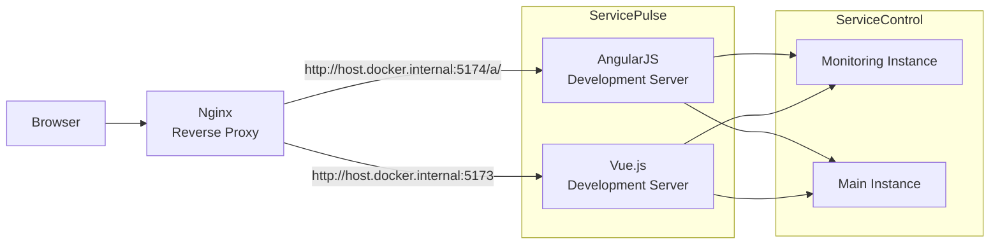

# ServicePulse 

## Production monitoring for distributed systems
Real-time monitoring customized to fit distributed applications in general, and your application's specific needs in particular.

Keep track of the health of your system's endpoints, monitor for any processing errors, send failed messages for reprocessing and make sure your specific environment's needs are met, all in one consolidated dashboard.

## Setting up the project for development

ServicePulse is in the proces of migrating from AngularJS to Vue.js, during both frameworks are used to server parts of the application. In development environment process AngularJS and Vue.js http servers are run side-by-side behind reverse proxy. This enalbes acessing both applications from the same domain i.e. `localhost:1331` where uri prefixed with `/a/` are served by AngularJS and rest is handled by Vue.js. This mimics the production deployment where Vue.js application is deployed in the main folder and AngularJS in `/a/` subfolders. 


### Setting up ServiceControl Main and ServiceControl Monitoring instances

ServicePulse mostly presents data provided by [ServiceControl](http://github.com/Particular/ServiceControl) and [ServiceControl Monitoring](https://github.com/Particular/ServiceControl.Monitoring) instances.

The URLs for both services can be set in `ServicePulse.Host/vue/public/app/js/app.constants.js` under the constant `scConfig`.


### Setting up package manager

ServicePulse uses npm and bower as package managers. For the solution to work dependencies needs to be downloaded before opening the ServicePulse website.

#### Install dependencies

Install the following dependencies if you don't have them installed yet

 - [Node.js](https://nodejs.org/en/download/)
 - [Git for Windows](https://git-for-windows.github.io/)
 - [Docker](https://docs.docker.com/get-docker/)
 - Chutzpah
   - [Test Adapter for the Test Explorer](https://marketplace.visualstudio.com/items?itemName=vs-publisher-2795.ChutzpahTestAdapterfortheTestExplorer)
   - [Test Runner Context Menu Extension](https://marketplace.visualstudio.com/items?itemName=vs-publisher-2795.ChutzpahTestRunnerContextMenuExtension)

#### Set development environment


- Run Nginx reverse proxy
  - Open cmd window and navigate into `ServicePulse\src\ServicePulse.Host` path (make sure you are using cmd, not PowerShell)
  - run `nginx` that stiches together `angular` and `vue` spas using
 ```cmd
 > docker run -it --rm -p 1331:1331 -v %cd%/nginx.conf:/etc/nginx/nginx.conf:ro --name service-pulse-dev nginx
 ```
- Run AngularJS development server 
  - Open cmd window and navigate into `ServicePulse\src\ServicePulse.Host\angular` path
  - run `npm install` to install all the npm dependencies
  - run the following command `npm run dev`. This will host a dev server on port 5174 and start watching for changes in `/angular` directory
 
- Run Vue development server 
  - Open cmd window and navigate into `ServicePulse\src\ServicePulse.Host\vue` path
  - run `npm install` to install all the npm dependencies
  - run the following command `npm run dev`. This will host a dev server on port 5173 and start watching for changes in `/vue` directory

In case `npm run dev` fails with an error related to git submodule not properly configured, run the `npm install` command again to ensure all required dependencies are available, and then run `npm run dev`.

After doing the above steps one can open `http://localhost:1331` to see ServicePulse application.

#### Provided npm scripts
 - `test` - runs js tests in ServicePulse.Host.Test project
 - `setup` - this command runs few commands
 	- installs the npm packages
 	- runs `webpack`  
 - `load` - this command does the same thing that `setup` but webpack is run only once to produce artifacts. This command is used by the builder
 - `serve` - serves js artifacts using `http-server`
 - `webpack` - runs webpack command, which does the following things for the given modules (monitoring, configuration)
	 - joins js together 
	 - runs babel transpiler 
	 - has a file watcher to run the above whenever file is saved
 - `lint` - checks with eslint all js files
 - `dev` - runs in parallel two scripts `webpack` and `serve`

NOTE:
Webpack observes files and updates the artifacts whenever they are changed, however at the moment not every bit of code is processed by webpack. Only monitoring and configuration is.

### Configuring automated tests

For information how to run automated tests please follow [ServicePulse.Host.Tests/Readme](https://github.com/Particular/ServicePulse/blob/master/src/ServicePulse.Host.Tests/README.md).

## Running from ServicePulse.Host.exe

It is possible to run ServicePulse directly via ServicePulse.Host.exe. As part of the ServicePulse.Host.csproj build process both angular and vue applications and bundled in to the exe file as embedded resources.

### Powershell Execution Policy

ServicePulse.Host uses Powershell to run Angular and Vue build scripts. In order to make this work make sure to enable Powershell script execution by executing:

```cmd
Set-ExecutionPoicy Unrestricted
```
### URL ACL Reservation

ServicePulse.Host.exe depends on a self-hosted webserver. In order to start the project a URL ACL reservation needs to be setup. Either run Visual Studio with Administrative privileges or run the following command to add the required URL ACL reservation:

```
netsh http add urlacl url=http://+:8081/ user=Everyone
```
## Supported browser versions

ServicePulse is supported on the following desktop browser versions:

- Chrome [latest major version](https://chromereleases.googleblog.com/)
- Edge with EdgeHTML v17+
- Firefox ESR [current version](https://www.mozilla.org/en-US/firefox/organizations/)
- Safari [latest major version](https://developer.apple.com/safari/download/)

## Docker image deployment

Dockerfiles for ServicePulse reside within the [`src`](https://github.com/Particular/ServicePulse/tree/master/src) folder. There are 2 docker files:

* 1 for a [Windows image](https://github.com/Particular/ServicePulse/blob/master/src/dockerfile.iis)
* 1 for a [Linux image](https://github.com/Particular/ServicePulse/blob/master/src/dockerfile.nginx)

### Building & staging docker images

The docker files are all built as part of the [release workflow](https://github.com/Particular/ServicePulse/blob/master/.github/workflows/release.yml), pushed to dockerhub, and tagged with the version of ServicePulse being deployed.

E.g. If we were deploying version 1.30.1 of ServicePulse, the build configurations after the Deploy step will build the following 2 containers for ServicePulse and tag them `1.30.1`:

* `particular/servicepulse:1.30.1`
* `particular/servicepule-windows:1.30.1`

These images are tagged with the specific version of ServicePulse being built and pushed to the corresponding public `particular/servicepulse{-os}` repositories. At this point, the docker images are considered staged. This means that if someone is watching the feed directly, they can install the staged images by explicitly specifying the exact tag, e.g. `docker pull particular/servicepulse:1.30.1`.

### Promoting docker images to production

When a ServicePulse release is promoted to production, one of the steps is to take the staged images and to re-tag them as the following:

* `particular/servicepulse:1.30.1` => `particular/servicepulse:1`
  * This is so that customers who are only interested in updates within a major can install the specific major only and not worry about breaking changes between major versions being automatically rolled out. Useful for auto upgrading containers in a *production* environment.
* `particular/servicepulse:1.30.1` => `particular/servicepulse:latest`
  * Primarily for developers wanting to use the latest version (`docker-compose up -d --build --force-recreate --renew-anon-volumes`
  * This is only in the case where the release's major version is the same as the current latest major version.
    * If a fix is being backported to a previous major then the `:latest` tag will not be updated.
    * If a release targets the current latest major or is a new major after the previous latest then the `:latest` tag is updated to match the version being released.

Once the tagging has been completed, the images are considered to be publicly released.
