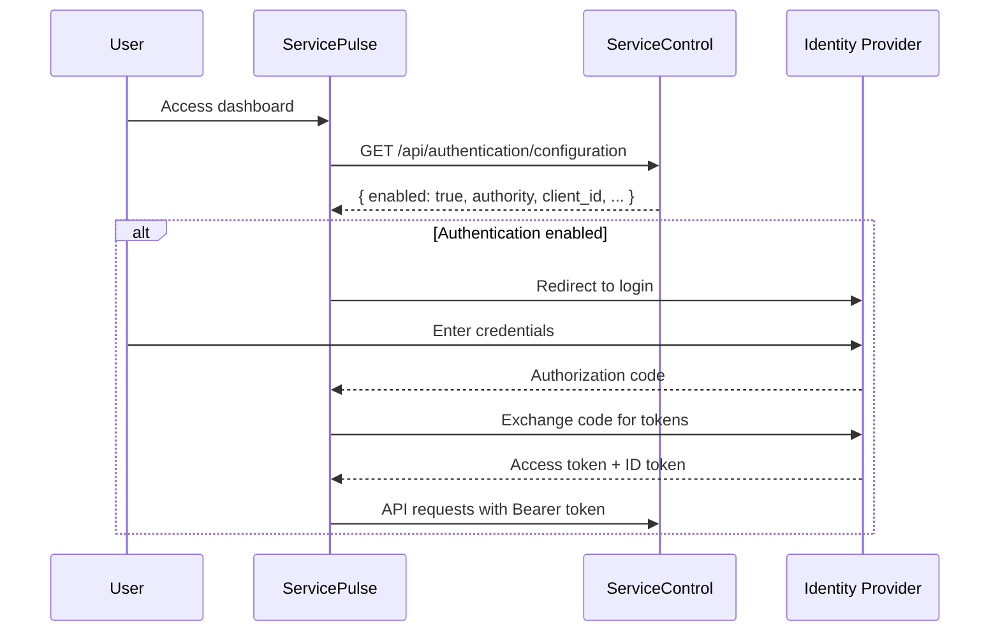

# Authentication

ServicePulse supports optional authentication using OpenID Connect (OIDC). When enabled, users must sign in with your identity provider before accessing the dashboard.

## Overview

Authentication in ServicePulse is:

- **Optional** - Disabled by default
- **Configured in ServiceControl** - ServicePulse fetches authentication settings from the ServiceControl API
- **OIDC-based** - Works with any OpenID Connect compliant identity provider (Microsoft Entra ID, Okta, Auth0, Keycloak, etc.)

## How It Works

When authentication is enabled:

1. ServicePulse fetches the authentication configuration from ServiceControl
2. If no valid session exists, users are redirected to the identity provider
3. After successful login, ServicePulse receives tokens via the OIDC Authorization Code flow
4. API requests to ServiceControl include the access token in the `Authorization` header
5. Tokens are automatically renewed in the background before expiration

## Configuration

Authentication is configured in ServiceControl, not ServicePulse. The following settings are available:

| Setting | Description |
|---------|-------------|
| `enabled` | Enable or disable authentication |
| `authority` | The OIDC authority URL (identity provider) |
| `client_id` | The OIDC client ID registered with your identity provider |
| `api_scopes` | API scopes to request (space-separated or JSON array) |
| `audience` | The audience claim for the access token (required by some identity providers) |

Refer to the [ServiceControl documentation](https://docs.particular.net/servicecontrol/) for instructions on configuring authentication settings.

## Identity Provider Setup

When registering ServicePulse with your identity provider, configure the following:

| Setting | Value |
|---------|-------|
| Application type | Single Page Application (SPA) |
| Grant type | Authorization Code with PKCE |
| Redirect URI | `https://your-servicepulse-url/` |
| Post-logout redirect URI | `https://your-servicepulse-url/` |
| Silent renew URI | `https://your-servicepulse-url/silent-renew.html` |

### Required Scopes

ServicePulse requests the following OIDC scopes in addition to any API scopes configured:

- `openid` - Required for OIDC
- `profile` - User's name and profile information
- `email` - User's email address
- `offline_access` - Enables refresh tokens for silent renewal

## Token Management

### Storage

User tokens are stored in the browser's `sessionStorage`. This means:

- Tokens are cleared when the browser tab is closed
- Each browser tab maintains its own session
- Tokens are not shared across tabs

### Silent Renewal

ServicePulse automatically renews access tokens before they expire using a hidden iframe (`silent-renew.html`). This provides a seamless experience without requiring users to re-authenticate.

If silent renewal fails (e.g., session expired at the identity provider), users are redirected to log in again.

## User Interface

When authentication is enabled and the user is signed in, the dashboard header displays:

- User's name (from the `name` claim)
- User's email (from the `email` claim)
- A sign-out button

## Troubleshooting

### "Authentication required" error

This error appears when:

1. Authentication is enabled but no valid token exists
2. The token has expired and silent renewal failed
3. The user cancelled the login flow

**Solution:** Click the login button or refresh the page to initiate authentication.

### Redirect loop or login failures

Common causes:

1. **Incorrect redirect URI** - Ensure the redirect URI registered with your identity provider exactly matches the ServicePulse URL (including trailing slash if present)
2. **CORS issues** - Your identity provider must allow requests from the ServicePulse origin
3. **Clock skew** - Ensure server clocks are synchronized; token validation is time-sensitive

### Silent renewal fails repeatedly

This can occur when:

1. The identity provider session has expired
2. Third-party cookies are blocked (required for iframe-based renewal)
3. The `silent-renew.html` page is not accessible

**Solution:** Check browser console for specific error messages. Some browsers block third-party cookies by default, which can prevent silent renewal from working.

### Token not included in API requests

Verify that:

1. Authentication is enabled in ServiceControl
2. The user has completed the login flow
3. The token has not expired

Check the browser's Network tab to confirm the `Authorization: Bearer` header is present on API requests.

## Security Considerations

### HTTPS Required

For production deployments, always use HTTPS. OIDC tokens are sensitive credentials that should only be transmitted over encrypted connections.

### Token Exposure

Since ServicePulse is a single-page application, tokens are accessible to JavaScript code running in the browser. Ensure that:

- Only trusted users have access to ServicePulse
- Content Security Policy (CSP) headers are configured to prevent XSS attacks
- The ServicePulse application is served from a trusted source

### Session Duration

Token lifetime is controlled by your identity provider. Consider configuring:

- **Access token lifetime** - Short-lived (e.g., 1 hour) for security
- **Refresh token lifetime** - Longer-lived to enable silent renewal
- **Session policies** - Maximum session duration before re-authentication is required

## See Also

- [Local Authentication Testing](local-authentication-testing.md) - Scenario-based testing guide for authentication
- [ServiceControl Authentication Documentation](https://docs.particular.net/servicecontrol/) - Configure authentication settings in ServiceControl
- [HTTPS Configuration](https-configuration.md) - Configure HTTPS for secure token transmission
