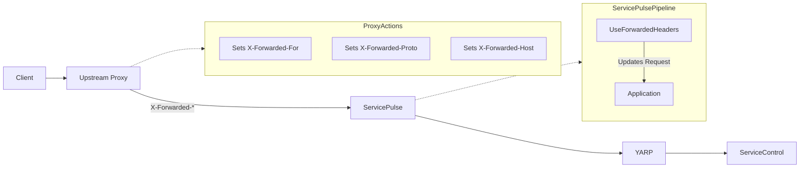

# Forwarded Headers Configuration

When ServicePulse is deployed behind a reverse proxy (like nginx, Traefik, or a cloud load balancer) that terminates SSL/TLS, you need to configure forwarded headers so ServicePulse correctly understands the original client request.

## ServicePulse (.NET 8)

### Environment Variables

| Variable                                        | Default | Description                                                      |
|-------------------------------------------------|---------|------------------------------------------------------------------|
| `SERVICEPULSE_FORWARDEDHEADERS_ENABLED`         | `true`  | Enable forwarded headers processing                              |
| `SERVICEPULSE_FORWARDEDHEADERS_TRUSTALLPROXIES` | `true`  | Trust all proxies (auto-disabled if known proxies/networks set)  |
| `SERVICEPULSE_FORWARDEDHEADERS_KNOWNPROXIES`    | (none)  | Comma-separated IP addresses of trusted proxies                  |
| `SERVICEPULSE_FORWARDEDHEADERS_KNOWNNETWORKS`   | (none)  | Comma-separated CIDR networks (e.g., `10.0.0.0/8,172.16.0.0/12`) |

### Docker Examples

**Trust all proxies (default, suitable for containers):**

```bash
docker run -p 9090:9090 \
  -e SERVICEPULSE_FORWARDEDHEADERS_ENABLED=true \
  particular/servicepulse:latest
```

**Restrict to specific proxies:**

```bash
docker run -p 9090:9090 \
  -e SERVICEPULSE_FORWARDEDHEADERS_ENABLED=true \
  -e SERVICEPULSE_FORWARDEDHEADERS_KNOWNPROXIES=127.0.0.1,10.0.0.5 \
  particular/servicepulse:latest
```

**Restrict to specific networks:**

```bash
docker run -p 9090:9090 \
  -e SERVICEPULSE_FORWARDEDHEADERS_ENABLED=true \
  -e SERVICEPULSE_FORWARDEDHEADERS_KNOWNNETWORKS=10.0.0.0/8,172.16.0.0/12 \
  particular/servicepulse:latest
```

When `SERVICEPULSE_FORWARDEDHEADERS_KNOWNPROXIES` or `SERVICEPULSE_FORWARDEDHEADERS_KNOWNNETWORKS` are set, `SERVICEPULSE_FORWARDEDHEADERS_TRUSTALLPROXIES` is automatically disabled.

## ServicePulse.Host (.NET Framework)

### Command-Line Arguments

| Argument                             | Default | Description                                                     |
|--------------------------------------|---------|-----------------------------------------------------------------|
| `--forwardedheadersenabled=`         | `true`  | Enable forwarded headers processing                             |
| `--forwardedheaderstrustallproxies=` | `true`  | Trust all proxies (auto-disabled if known proxies/networks set) |
| `--forwardedheadersknownproxies=`    | (none)  | Comma-separated IP addresses of trusted proxies                 |
| `--forwardedheadersknownnetworks=`   | (none)  | Comma-separated CIDR networks                                   |

### Examples

**Trust all proxies (default):**

```cmd
ServicePulse.Host.exe --url=http://localhost:8081
```

**Restrict to specific proxies:**

```cmd
ServicePulse.Host.exe --url=http://localhost:8081 --forwardedheadersknownproxies=127.0.0.1,10.0.0.5
```

**Restrict to specific networks:**

```cmd
ServicePulse.Host.exe --url=http://localhost:8081 --forwardedheadersknownnetworks=10.0.0.0/8,172.16.0.0/12
```

## What Headers Are Processed

When enabled, ServicePulse processes:

- `X-Forwarded-For` - Original client IP address
- `X-Forwarded-Proto` - Original protocol (http/https)
- `X-Forwarded-Host` - Original host header

## Interaction with Built-in Reverse Proxy

ServicePulse includes a built-in YARP reverse proxy that forwards requests to ServiceControl and Monitoring instances. The forwarded headers configuration does **not** affect this proxy.

### Request Flow



- **UseForwardedHeaders** processes incoming headers from an upstream proxy so ServicePulse understands the original client request (scheme, host, client IP)
- **YARP** independently handles outgoing requests to ServiceControl/Monitoring backends

These operate at different points in the request flow and do not conflict.

## HTTP to HTTPS Redirect

When using a reverse proxy that terminates SSL, you can configure ServicePulse to redirect HTTP requests to HTTPS. This works in combination with forwarded headers:

1. The reverse proxy forwards both HTTP and HTTPS requests to ServicePulse
2. The proxy sets `X-Forwarded-Proto` to indicate the original protocol
3. ServicePulse reads this header (via forwarded headers processing)
4. If the original request was HTTP and redirect is enabled, ServicePulse returns a redirect to HTTPS

To enable HTTP to HTTPS redirect:

**ServicePulse (.NET 8):**

```bash
SERVICEPULSE_HTTPS_REDIRECTHTTPTOHTTPS=true
```

**ServicePulse.Host (.NET Framework):**

```cmd
--httpsredirecthttptohttps=true
```

See [HTTPS Configuration](https-configuration.md) for more details.

## Proxy Chain Behavior (ForwardLimit)

When processing `X-Forwarded-For` headers with multiple IPs (proxy chains), the behavior depends on trust configuration:

| Configuration             | ForwardLimit      | Behavior                                      |
|---------------------------|-------------------|-----------------------------------------------|
| `TrustAllProxies = true`  | `null` (no limit) | Processes all IPs, returns original client IP |
| `TrustAllProxies = false` | `1` (default)     | Processes only the last proxy IP              |

For example, with `X-Forwarded-For: 203.0.113.50, 10.0.0.1, 192.168.1.1`:

- **TrustAllProxies = true**: Returns `203.0.113.50` (original client)
- **TrustAllProxies = false**: Returns `192.168.1.1` (last proxy)

## Security Considerations

By default, `TrustAllProxies` is `true`, which is suitable for container deployments where the proxy is trusted infrastructure. For production deployments with untrusted networks, consider restricting to known proxies or networks to prevent header spoofing attacks.

### Forwarded Headers Behavior

When the proxy is trusted:

- `Request.Scheme` will be set from `X-Forwarded-Proto` (e.g., `https`)
- `Request.Host` will be set from `X-Forwarded-Host` (e.g., `servicepulse.example.com`)
- Client IP will be available from `X-Forwarded-For`

When the proxy is **not** trusted (incorrect `KnownProxies`):

- `X-Forwarded-*` headers are **ignored** (not applied to the request)
- `Request.Scheme` remains `http`
- `Request.Host` remains the internal hostname
- The request is still processed (not blocked)

## See Also

- [Forwarded Headers Testing](forwarded-headers-testing.md) - Test forwarded headers configuration with curl
- [Reverse Proxy Testing](nginx-testing.md) - Guide for testing with NGINX reverse proxy locally
- [HTTPS Configuration](https-configuration.md) - Configure direct HTTPS without a reverse proxy
- [Authentication](authentication.md) - Configure OIDC authentication for ServicePulse
