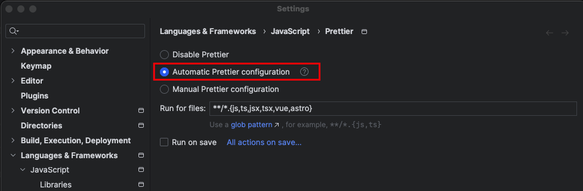

# Setting up your IDE

- [Setting up your IDE](#setting-up-your-ide)
  - [Webstorm](#webstorm)
    - [Configuration](#configuration)
      - [Keymap](#keymap)
      - [Other settings](#other-settings)
  - [VSCode](#vscode)
    - [Extensions](#Extensions)

Although we don't prescribe the tools you use to develop the portal, we strongly recommend using Webstorm or VSCode. Without the extensions available in these IDE's, changes made could conflict with formatting or style rules that will lead to automatic changes on unrelated branches in future.

## Webstorm

### Configuration

A lot of the project-specific settings in Webstorm are committed to our git repository, and you should inherit this configuration automatically. Some optional settings you may want to consider are listed below.  
By default we recommend the following settings for both ESlint and Prettier.



#### Keymap

You can change your KeyMap under `File | Settings | Keymap`. A good option is the `Visual Studio` keymap, as this will give you consistent keyboard shortcuts with Visual Studio / Rider, and is also the most commonly used keymap by developers at Particular.

#### Other settings

- To improve the quality of suggestions you receive when using code completion, go to `File | Settings | Editor | General | Code Completion` and enable `Only type-based completion`.

## VSCode

### Extensions

#### Option 1 (Recommended)

This option runs the formatter _and_ linter on every save, catching errors immediately in your IDE. The solution is small enough that the performance impact is negligible.

- Install the [ESLint](https://marketplace.visualstudio.com/items?itemName=dbaeumer.vscode-eslint) extension
- Enable the following user setting (there is no UI for this, but you can find the codeActionsOnSave setting in `File | Preferences | Settings` which will open the settings file at the correct location for you):

```json
{
  "editor.codeActionsOnSave": {
    "source.fixAll.eslint": true
  }
}
```

#### Option 2

This option will run a formatter on every save, which is very quick. Use this if you prefer a lighter-weight setup.

- Install the [Prettier](https://marketplace.visualstudio.com/items?itemName=esbenp.prettier-vscode) extension
  - In VSCode `File | Preferences | Settings`, set default formatter to Prettier and check 'Format on Save'
    
- **Important:** Run `npm run lint` before committing code to catch any style or code issues that Prettier doesn't cover
